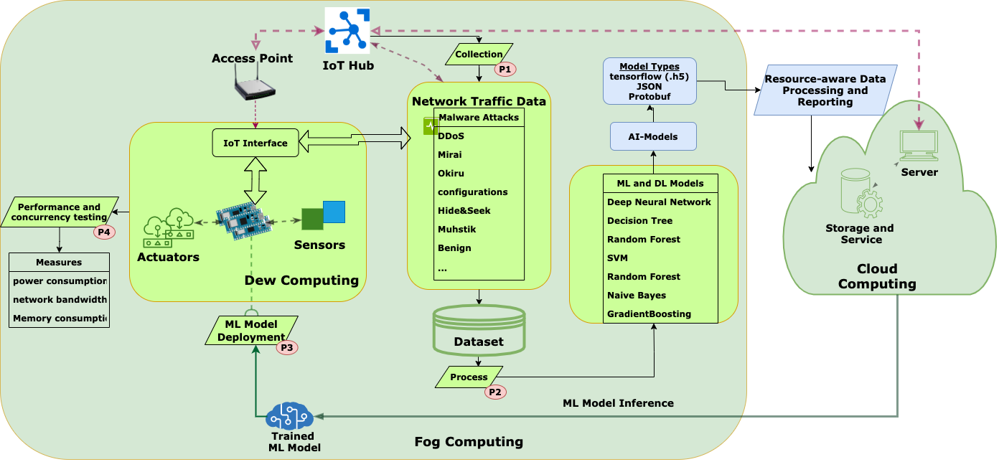
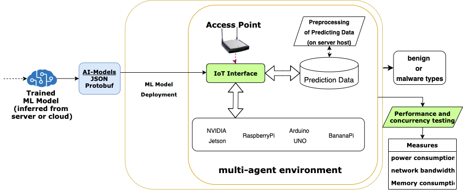

# ENViSEC: AI-enabled Cybersecurity for Future Smart Environments:

In this study, we propose an approach with a framework to discover malware attacks
on IoT devices using artificial intelligence (AI) enabled methods.
The work belongs to the ENViSEC project which aims at developing top-notch solutions
for bringing IoT security forward and offering similarity-based detection using AI models.
For more details please visit, [SmartSecLab](https://smartseclab.com/envisec/) and
[Kristiania University College](https://www.kristiania.no/en/research/research-projects/kuc/envisec-artificial-intelligence--enabled-cybersecurity-for-future-smart-environments/).

## Dataset used for attack detection in IoT devices

We have taken [Aposemat IoT-23](https://www.stratosphereips.org/datasets-iot23)
and [Edge-IIoTset](https://ieee-dataport.org/documents/edge-iiotset-new-comprehensive-realistic-cyber-security-dataset-iot-and-iiot-applications#files)
datasets for training and testing the machine learning models.
The IoT-23 dataset is semi-structured logging information of the packets labeled with malicious and benign IoT network traffic.
The refined data is used for both training and predicting
the attacks and malware in multi-agent systems.

## Framework:
The building block of the proposed framework (Please refer our paper for detailed description):

## Experiments:

The processed CSV data files are used for training and testing the models.

### Preprocessing and training the model:

`$ sh scripts/preprocess.sh` | script to generate the refined version of the dataset from the original raw dataset. \
`$ python3 src/run.py` | training one of the AI models, Deep Neural Networks, Support Vector Machine, Decision Tree,
Random Forests, other shallow learning models on the dataset specified in `config.yaml`.  \

### Prediction of cyberattacks:

The light-weight version of the trained ML model is deployed to the IoT nodes
to identify the malware and attacks on Smart Environment network connected to the access point.

`$ python3 rpi/publish.py` | to publish the processed running network traffic data on the localhost. \
`$ python3 rpi/predict.py`  | to predict the cyberattacks on the processed data in the gateways.

The following figure shows the AI model transfer and prediction approach.

### Test-cases and middleware architecture:
The proposed middleware architecture with some hardware test-cases to replicate the real-world scenarios 
are presented in the `firmware` directory.

## Citation:
Please cite this project work by referring to these papers:

> Guru Bhandari, Andreas Lyth, Andrii Shalaginov and Tor-Morten Grønli,
> "Distributed Deep Neural-Network-Based Middleware for Cyber-Attacks Detection in Smart IoT Ecosystem: 
> A Novel Framework and Performance Evaluation Approach", Electronics, 2023, 12(2), 298. 
> https://doi.org/10.3390/electronics12020298. 

    @article{bhandari2023distributed,
    title={Distributed Deep Neural-Network-Based Middleware for Cyber-Attacks Detection in Smart IoT Ecosystem: \
    A Novel Framework and Performance Evaluation Approach},
    author={Bhandari, Guru and Lyth, Andreas and Shalaginov, Andrii and Grønli, Tor-Morten},
    journal={Electronics},
    volume={12},
    number={2},
    pages={298},
    doi={10.3390/electronics12020298}
    year={2023},
    publisher={MDPI}
    }

> Guru Prasad Bhandari, Andreas Lyth, Andrii Shalaginov and Tor-Morten Grønli, 
> "Artificial Intelligence Enabled Middleware for Distributed Cyberattacks Detection in IoT-based Smart Environments", 
> 2022 IEEE International Conference on Big Data (Big Data), Osaka, Japan, 2022, pp. 3023-3032, 
> https://doi.org/10.1109/BigData55660.2022.10020531.

    @inproceedings{bhandari2022:artificial,
    author={Bhandari, Guru Prasad and Lyth, Andreas and Shalaginov, Andrii and Grønli, Tor-Morten},
    title={Artificial Intelligence Enabled Middleware for Distributed Cyberattacks Detection in IoT-based Smart Environments},
    booktitle={2022 IEEE International Conference on Big Data (Big Data)},
    year={2022},
    pages={3023-3032},
    publisher = {{IEEE}}
    doi={10.1109/BigData55660.2022.10020531}
    }

## Acknowledgements:
This work is a part of the [ENViSEC](https://smartseclab.com/envisec/) project which has received funding 
from the‌ European Union’s Horizon 2020 research and innovation program within the framework of the NGI POINTER 
Project funded under grant agreement# 871528.
