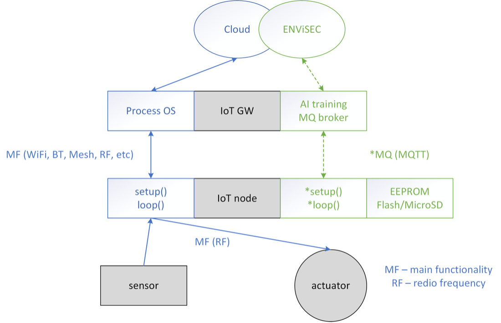

# Description of firmware part of the project:

The purpose of this document is to provide an understanding of the proposed middleware architecture, components, functional, and non-functional requirements for any kind of cross-platform deployment, as shown in the figure of the proposed framework. 

